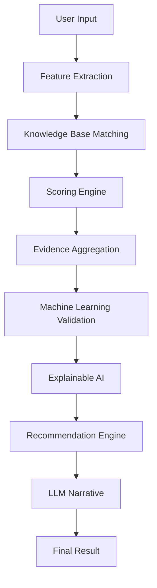

# Lost Talent Detector AI v3

1. Latar Belakang

2. Permasalahan AI Lama

3. Tujuan AI Baru

4. Arsitektur Hybrid Explainable AI

5. Pipeline AI

6. Knowledge Base

7. Feature Extraction

8. Scoring Engine

9. Machine Learning Validation

10. Explainable AI

11. Evidence Aggregation

12. Recommendation Engine

13. Peran LLM

14. Struktur Folder

15. Output AI

16. Keunggulan AI

# Lost Talent Detector AI v3

## Tujuan

Membangun sistem pendeteksi bakat berbasis Hybrid Explainable AI yang menggabungkan Knowledge Base, Rule-Based Scoring, Machine Learning Validation, Explainable AI, dan Large Language Model untuk menghasilkan rekomendasi bakat yang konsisten, transparan, dan mudah dipahami.

---

## Arsitektur

User Input

↓

Feature Extraction

↓

Knowledge Base Matching

↓

Scoring Engine

↓

Evidence Aggregation

↓

Machine Learning Validation

↓

Explainable AI

↓

Recommendation Engine

↓

LLM Narrative

↓

Output

---

## Komponen

### Knowledge Base

Menyimpan informasi setiap bidang bakat.

Contoh

- Mata Pelajaran
- Prestasi
- Hobi
- Minat
- RIASEC
- Sertifikasi
- Karier
- Organisasi
- Kompetisi

Minimal mendukung sekitar 50 bidang.

---

### Feature Extraction

Mengubah seluruh input pengguna menjadi data terstruktur.

Input

- Nilai
- Prestasi
- Hobi
- Minat
- RIASEC

Output

Feature Vector

---

### Scoring Engine

Menghitung skor setiap bidang.

Komponen

- Academic
- Achievement
- Hobby
- Interest
- RIASEC

Output

Top 5 Talent

---

### Evidence Aggregation

Menghitung jumlah evidence.

Positive Evidence

Negative Evidence

Evidence Coverage

Confidence

---

### Machine Learning

Random Forest digunakan sebagai validator apabila dua bidang memiliki skor yang hampir sama.

Random Forest bukan penentu utama.

---

### Explainable AI

Menjelaskan alasan pemilihan bakat.

Contoh

✔ Nilai Informatika tinggi

✔ Juara Hackathon

✔ Hobi Coding

✔ Minat Software Engineer

---

### Recommendation Engine

Memberikan

- Karier
- Lomba
- Organisasi
- Sertifikasi
- Roadmap

---

### LLM

LLM tidak menentukan bakat.

LLM hanya membuat narasi berdasarkan hasil final.

---

## Output

Primary Talent

Secondary Talent

Supporting Talent

Confidence

Evidence

Reasoning

Recommendation

Narrative

# 🧠 Lost Talent Detector AI v3

> Hybrid Explainable AI untuk mendeteksi bakat berdasarkan nilai, prestasi, hobi, minat, dan hasil tes RIASEC.

---

# 📚 Table of Contents

- Overview
- Tujuan
- Arsitektur AI
- AI Pipeline
- Komponen AI
- Struktur Folder
- Output AI
- Developer Notes

---

# 📖 Overview

Lost Talent Detector adalah sistem Hybrid Explainable AI yang dirancang untuk menghasilkan rekomendasi bakat secara konsisten, transparan, dan dapat dijelaskan.

Berbeda dengan AI generatif yang mengambil keputusan secara langsung, sistem ini menggunakan kombinasi:

- Knowledge Base
- Feature Extraction
- Scoring Engine
- Evidence Aggregation
- Machine Learning Validation
- Explainable AI
- Recommendation Engine
- Large Language Model

LLM **bukan penentu hasil**, melainkan hanya bertugas menyusun narasi berdasarkan keputusan sistem.

---

# 🎯 Tujuan

- Mengurangi hallucination dari LLM.
- Menyesuaikan hasil dengan minat pengguna.
- Menghasilkan rekomendasi yang konsisten.
- Menjelaskan alasan setiap rekomendasi.
- Memberikan roadmap pengembangan diri.

---

# 🏗 Arsitektur AI



---

# ⚙ AI Pipeline

## 1. User Input

Data yang dikumpulkan:

- Nilai Akademik
- Prestasi
- Hobi
- Minat
- Hasil Tes RIASEC

---

## 2. Feature Extraction

Melakukan:

- Normalisasi data
- Alias Matching
- Keyword Matching
- Subject Matching

Output:

Feature Vector

---

## 3. Knowledge Base Matching

Knowledge Base menyimpan informasi mengenai seluruh bidang bakat.

Setiap bidang memiliki:

- Mata Pelajaran
- Prestasi
- Sertifikasi
- Hobi
- Minat
- RIASEC
- Karier
- Kompetisi
- Organisasi
- Roadmap

Minimal mendukung ±50 bidang.

---

## 4. Scoring Engine

Menghitung skor setiap bidang menggunakan lima komponen utama.

| Komponen | Bobot |
|----------|-------|
| Nilai | 35% |
| Prestasi | 20% |
| Minat | 20% |
| Hobi | 15% |
| RIASEC | 10% |

Output:

Top 5 Talent

---

## 5. Evidence Aggregation

Menghitung:

- Positive Evidence
- Negative Evidence
- Evidence Coverage

Contoh

Programming

✅ Nilai

❌ Prestasi

❌ Hobi

❌ Minat

Coverage

20%

---

## 6. Machine Learning Validation

Random Forest hanya dijalankan apabila dua bidang memiliki skor yang hampir sama.

Contoh

Programming

91

Robotik

90

↓

Random Forest dijalankan.

Jika selisih skor jauh maka hasil Scoring Engine langsung digunakan.

---

## 7. Explainable AI

Menghasilkan alasan rekomendasi.

Contoh

✔ Nilai Pengelasan tinggi

✔ Juara LKS Welding

✔ Hobi Mengelas

✔ Minat Welder

✔ RIASEC Realistic

---

## 8. Recommendation Engine

Memberikan rekomendasi:

- Karier
- Sertifikasi
- Organisasi
- Kompetisi
- Roadmap Belajar

---

## 9. LLM

LLM hanya menyusun narasi.

LLM **tidak boleh** mengubah hasil Scoring Engine.

---

# 📂 Struktur Folder

```
ai/

├── app/
│   ├── feature_extraction/
│   ├── knowledge_base/
│   ├── scoring/
│   ├── evidence/
│   ├── machine_learning/
│   ├── recommendation/
│   ├── prompt/
│   ├── explainable_ai/
│   └── utils/
│
├── knowledge/
│   └── knowledge_base.json
│
├── models/
│   └── random_forest.pkl
│
├── dataset/
│
├── training/
│
└── api/
```

---

# 📄 Output AI

Contoh response:

```json
{
  "primary_talent": "Programming",
  "secondary_talent": [
    "Artificial Intelligence",
    "Data Science",
    "Cyber Security"
  ],
  "confidence": 95,
  "evidence": {
    "academic": 34,
    "achievement": 18,
    "interest": 20,
    "hobby": 14,
    "riasec": 9
  },
  "recommendation": {
    "career": [],
    "competition": [],
    "certification": [],
    "roadmap": []
  },
  "analysis": ""
}
```

---

# 📋 Checklist Implementasi

- [ ] Feature Extraction
- [ ] Knowledge Base
- [ ] Alias Matching
- [ ] Subject Matching
- [ ] Achievement Matching
- [ ] Scoring Engine
- [ ] Evidence Aggregation
- [ ] Random Forest Validation
- [ ] Explainable AI
- [ ] Recommendation Engine
- [ ] Gemini Prompt
- [ ] REST API
- [ ] Laravel Integration

---

# 💡 Developer Notes

1. Machine Learning bukan penentu utama.
2. Knowledge Base menjadi sumber kebenaran (source of truth).
3. Semua keputusan berasal dari Scoring Engine.
4. LLM hanya menghasilkan narasi.
5. Seluruh rekomendasi harus dapat dijelaskan (Explainable AI).
6. Penambahan bidang baru cukup melalui `knowledge_base.json` tanpa mengubah logika aplikasi.